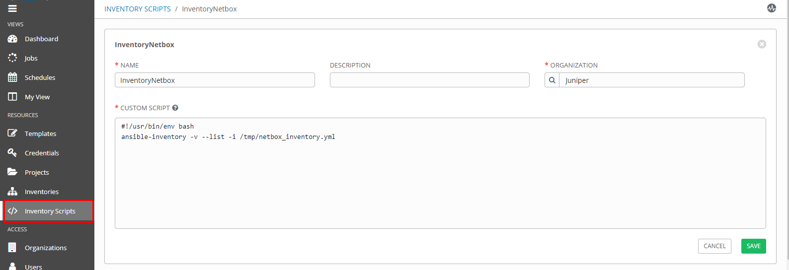
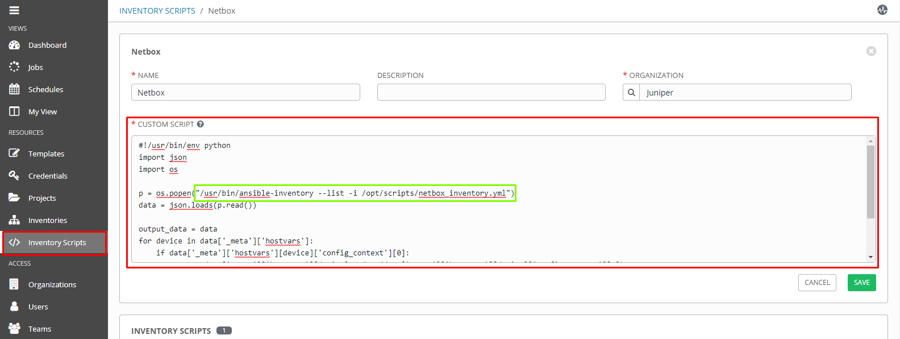

# Create inventory in Ansible Tower (AWX) based on default netbox Ansbile plugin


 Before you start:<br>
 Please note that all this was done on **OLD** legacy netbox ansible plugin.<br>
 Right now there is more advanced library to manage netbox available under this [Link](https://github.com/netbox-community/ansible_modules)


1) Put script ie. in /opt/scripts/pb.netbox_inventory.yml 

```yaml
plugin: netbox
api_endpoint: http://192.168.254.90
validate_certs: False
config_context: True
token: 678bcbfccbbcb6a59069438vv9b5d0f9e4a3081a
group_by:
  - device_roles
query_filters:
  - tag: ansible
compose:
  ansible_network_os: platform.slug

```

More details about [NetBox inventory source](https://docs.ansible.com/ansible/latest/plugins/inventory/netbox.html "Link")

2) In AWX 'Inventory Scripts' create new script which will generate JSON output:
```bash
#!/usr/bin/env bash
ansible-inventory -v --list -i /opt/scripts/netbox_inventory.yml
```



# Output example when we run playbook from bash level:
```bash
ansible-inventory -v --list -i /opt/scripts/netbox_inventory.yml
```

```json
Using /etc/ansible/ansible.cfg as config file
Fetching: http://192.168.254.90/api/dcim/sites/?limit=0
Fetching: http://192.168.254.90/api/dcim/regions/?limit=0
Fetching: http://192.168.254.90/api/tenancy/tenants/?limit=0
Fetching: http://192.168.254.90/api/dcim/racks/?limit=0
Fetching: http://192.168.254.90/api/dcim/device-roles/?limit=0
Fetching: http://192.168.254.90/api/dcim/platforms/?limit=0
Fetching: http://192.168.254.90/api/dcim/device-types/?limit=0
Fetching: http://192.168.254.90/api/dcim/manufacturers/?limit=0
Fetching: http://192.168.254.90/api/dcim/devices/?limit=0
Fetching: http://192.168.254.90/api/virtualization/virtual-machines/?limit=0
{
    "_meta": {
        "hostvars": {
            "Leaf-30": {
                "ansible_network_os": "junos",
                "config_context": [
                    {}
                ],
                "device_roles": [
                    "leaf_switch"
                ],
                "device_types": [
                    "vqfx-10000"
                ],
                "manufacturers": [
                    "Juniper"
                ],
                "platforms": [
                    "junos"
                ],
                "sites": [
                    "Warsaw DC1"
                ]
            },
            "Leaf-31": {
                "ansible_network_os": "junos",
                "config_context": [
                    {}
                ],
                "device_roles": [
                    "leaf_switch"
                ],
                "device_types": [
                    "vqfx-10000"
                ],
                "manufacturers": [
                    "Juniper"
                ],
                "platforms": [
                    "junos"
                ],
                "sites": [
                    "Warsaw DC1"
                ]
            },
            "Leaf-32": {
                "ansible_network_os": "junos",
                "config_context": [
                    {}
                ],
                "device_roles": [
                    "leaf_switch"
                ],
                "device_types": [
                    "vqfx-10000"
                ],
                "manufacturers": [
                    "Juniper"
                ],
                "platforms": [
                    "junos"
                ],
                "sites": [
                    "Warsaw DC1"
                ]
            },
            "Leaf-33": {
                "ansible_network_os": "junos",
                "config_context": [
                    {}
                ],
                "device_roles": [
                    "leaf_switch"
                ],
                "device_types": [
                    "vqfx-10000"
                ],
                "manufacturers": [
                    "Juniper"
                ],
                "platforms": [
                    "junos"
                ],
                "sites": [
                    "Warsaw DC1"
                ]
            },
            "Spine-20": {
                "ansible_host": "10.240.40.20",
                "ansible_network_os": "junos",
                "config_context": [
                    {
                        "ansible_password": "Juniper",
                        "ansible_user": "root"
                    }
                ],
                "device_roles": [
                    "spine_switch"
                ],
                "device_types": [
                    "vqfx-10000"
                ],
                "manufacturers": [
                    "Juniper"
                ],
                "platforms": [
                    "junos"
                ],
                "primary_ip4": "10.240.40.20",
                "sites": [
                    "Warsaw DC1"
                ],
                "tags": [
                    "ERB"
                ]
            },
            "Spine-21": {
                "ansible_host": "10.240.40.21",
                "ansible_network_os": "junos",
                "config_context": [
                    {}
                ],
                "device_roles": [
                    "spine_switch"
                ],
                "device_types": [
                    "vqfx-10000"
                ],
                "manufacturers": [
                    "Juniper"
                ],
                "platforms": [
                    "junos"
                ],
                "primary_ip4": "10.240.40.21",
                "sites": [
                    "Warsaw DC1"
                ]
            }
        }
    },
    "all": {
        "children": [
            "device_roles_leaf_switch",
            "device_roles_spine_switch",
            "ungrouped"
        ]
    },
    "device_roles_leaf_switch": {
        "hosts": [
            "Leaf-30",
            "Leaf-31",
            "Leaf-32",
            "Leaf-33"
        ]
    },
    "device_roles_spine_switch": {
        "hosts": [
            "Spine-20",
            "Spine-21"
        ]
    }
}

```


# PATCH: inventory_flat.py


### Before:
```json
 "Spine-20": {
                "ansible_host": "10.240.40.20",
                "ansible_network_os": "junos",
                "config_context": [
                    {
                        "ansible_password": "Juniper",
                        "ansible_user": "root"
                    }
                ],
                "device_roles": [
                    "spine_switch"
                ],
                "device_types": [
                    "vqfx-10000"
                ],
                "manufacturers": [
                    "Juniper"
                ],
                "platforms": [
                    "junos"
                ],
                "primary_ip4": "10.240.40.20",
                "sites": [
                    "Warsaw DC1"
                ],
                "tags": [
                    "ERB"
                ]
```

### With patch
```json
 "Spine-20": {
                "ansible_host": "10.240.40.20",
                "ansible_password": "Juniper",
                "ansible_user": "root",                       <----------- !!!
                "ansible_network_os": "junos",                <----------- !!!
                "device_roles": [
                    "spine_switch"
                ],
                "device_types": [
                    "vqfx-10000"
                ],
                "manufacturers": [
                    "Juniper"
                ],
                "platforms": [
                    "junos"
                ],
                "primary_ip4": "10.240.40.20",
                "sites": [
                    "Warsaw DC1"
                ],
                "tags": [
                    "ERB"
                ]
```